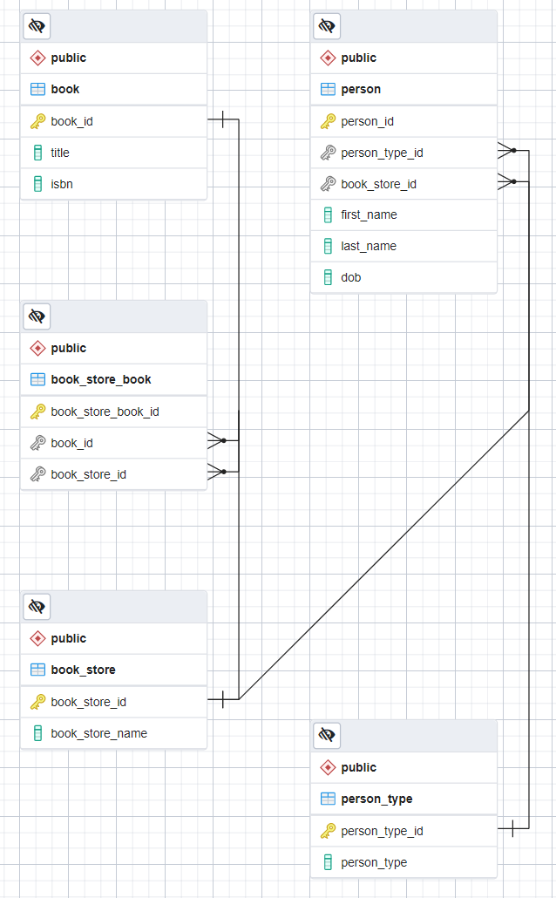

# JavaScript Postgres Assignments

The assignments for this section are divided into three parts:
- Queries
- Data Modeling
- Data Access

## Queries

Let's query a model that represents an old fashion brick and mortar bookstore.  A bookstore can have one to many books.  A Person can belong to a bookstore, and a person has one of the following types:
  - Manager
  - Cashier
  - Stock Person

Here is the ERD for this scenario:

#### Ex. 1 Select Person List
Create a query that returns the first and last name of all the people ordered by last name in descending order.

#### Ex. 2 Select Book
Create a query that returns all the information for a book with the title of "Everything I Never Told You".

#### Ex. 3 Select People Born
Create a query that returns the person id, first name, last name and date of birth of all the people that were born after 1980.

#### Ex. 4 Select 70s People
Create a query that returns the person id, first name, last name and date of birth of all the people that were born in the 70s.

#### Ex. 5 Update Person
Create a query that updates the first name of a person to "John" whose person id is 9.

#### Ex. 6 Insert Person
Create a query that adds a new cashier to the Books are Us bookstore.  Her information is:
 - First name: Sally
 - Last name: Mustang
 - DOB: 1/2/1965

#### Ex. 7 Select Count
Create a query that returns the number of people that are cashiers.

#### Ex. 8 Join: People
Create a query that returns the first name, last name, and person type of all the people.

#### Ex. 9 Join: Manager People
Create a query that returns the first name, last name, and person type for only the managers.

#### Ex. 10 Join: Bookstore
Create a query that returns all the books for the store whose name is Best Books in Town.  The query should return the book store id, book id, bookstore name, title and isbn.

## Data Modeling

#### Ex. 11 Lemonade Sales
Create a data model for a lemonade stand.  The model keeps track of sales of lemonade.  Lemonade comes in three sizes:
- Small: $1.00
- Medium: $2.00
- Large: $3.00

Lemonade comes in two flavors:
- Lemon
- Strawberry

Customers can purchase any number of drinks for any day.

#### Ex. 12 Bank Account
Create a data model for a bank.  The model supports the following account types:
- Checking
- Savings
- Retirement

Users can have balances in one or all of these accounts.  The model should keep track of when the accounts have been opened and closed.  Users have a first and last name and a username of their choice.

## Data Access

#### Ex. 13 Get Person
Create an arrow function called `getPerson` that accepts a person id and returns all the information for a person.

#### Ex. 14 Get Books
Create an arrow function called `getBooks` that accepts a bookstore id and returns all the books for this bookstore.

#### Ex. 15 Update Person
Create an arrow function called `updatePerson` that accepts a person id and a first name.  This function updates the first name of the person id passed into this function.

#### Ex. 16 Insert New Bookstore
Create an arrow function called `addBookstore` that adds a new bookstore to the bookstore table.

#### Ex. 17 Insert Add New Book
Create an arrow function called `addBook` that accepts a book title, isbn and bookstore id.  This function must insert into the `book` and `book_store_book` tables.
