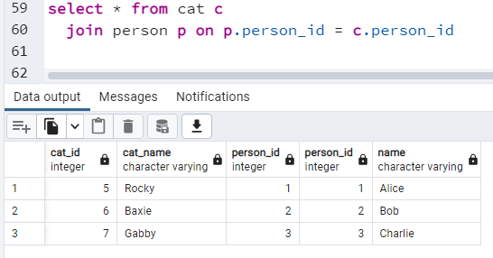

# JavaScript Postgres Database

Assignments are located [here](./assignments.md).

# Getting Started
- Clone this repo
- Install dependencies: `npm install`
- Copy & paste the contents of `bookstore-create.sql` and execute in your database using pgAdmin4

# SQL
SQL has two main parts:
- DDL (Data Definition Language)
- DML (Data Manipulation Language)

DDL
  - Create & Update 
    - Tables
    - Indexes
    - Sequences
    - Contraints

DML
  - CRUD (Create Recall Update Delete)
	- Joins

# SQL Reference
## CRUD
- Select
  - `select * from cat`
  - `select * from cat where age > 5 and age < 10`
  - `select count(*) from cat`
  - `select sum(cost) from book`
  - `select * from cat order by name desc`
  - `select * from cat where person_id is null`
  - `select * from cat where name like 'Roc%'`
- Update
  - `update cat set name = 'Freddy' where cat_id = 1`
- Insert
  - `insert into cat (name) values ('Jonesy')`
- Delete
  - `delete from cat where cat > 4`

## Joins

#### Inner
- `Table A join Table B`: Return ONLY the rows that match from Table A and Table B.
- No reason to specify "inner" (e.g. `inner join`)

Example:



#### Outer
- Left vs Right
  - `Table B right join Table A` is the same as `Table A left join Table B`
    - PROTIP: Prefer one or the other, but not both.  I prefer left join.
  - `Table A left join Table B`: Return EVERYTHING from the left table and return nulls from the right table if no match
  - No reason to specify "outer" (e.g. `outer left join`)

Example: 


## Database Design: Relationships
#### One to Many
Example #1: ONE showroom can contain MANY cars.  But one car CANNOT contain many showrooms.


Example #2: ONE customer can have MANY orders and MANY credit cards.  However, ONE credit card cannot belong to MANY people, one order cannot be owned by MANY people.


#### Many to Many
Example #1: A book can be sold in MANY bookstores.  A bookstore contains MANY books.


# Create Customer Table
```
create sequence cus_seq as integer;

create table customer (
  customer_id integer not null default nextval('cus_seq'),
  customer_name varchar(50)
);
				
alter sequence cus_seq owned by customer.customer_id;

```

# Videos
- [Creaet Sequence Counter (5m)](https://youtu.be/hpL9C5FWIRk)
- [Learn Basic SQL in 15 Minutes (15m)](https://youtu.be/kbKty5ZVKMY)

# Links
- [Postgres Queries with pg Library](https://onestepcode.com/postgres-nodejs-tutorial/)

# Connect to AWS Postgres
- Host: database-1.cosgu9wr5iwp.us-east-1.rds.amazonaws.com
- Port: 5432
- Maintaince database: stu{YOUR STUDENT ID}
- username: postgres
- password: ***

